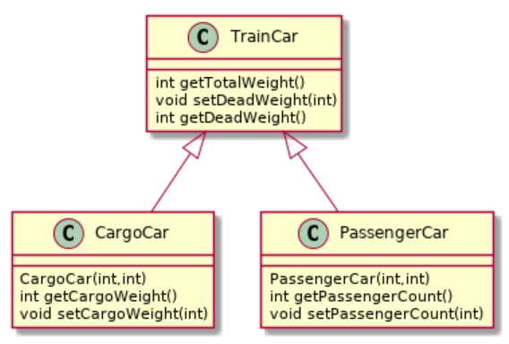

# Arv - Train-oppgave

I denne oppgaven skal vi modellere to typer togvogner og bruke dem i et tog. Vi vil bruke arv og samle det som er felles for togvognene i en _superklasse_.

Denne oppgaven er på likt format som dere møtte i [Øving 3 - Card-oppgaven](../oving3/Card.md), der det ikke blir oppgitt en detaljert beskrivelse av klassene her i `README`-filen, men heller gjennom Javadoc-dokumentasjonen. Dette er igjen for å gi dere øving i å lese og forstå dokumentasjon, som er et vanlig format å bli gitt oppgaver på eksamen.

> Kjapt tips: Hold musen over metoden/klassen for å lese Javadoc-dokumentasjonen på et fint format.

Filene i denne oppgaven skal legges i [oving7/train](../../src/main/java/oving7/train).

## Del 1 - TrainCar

I denne delen skal du lage en klasse kalt `TrainCar` for en enkel og generell togvogn, med funksjonalitet som beskrevet i Javadoc-dokumentasjonen i klassen. Se også diagrammet over.

Skjellet for klassen finner du i [oving7/train/TrainCar.java](../../src/main/java/oving7/train/TrainCar.java).

Testkode for oppgaven finner du her: [oving7/train/TrainCarTest.java](../../src/test/java/oving7/train/TrainCarTest.java).

## Del 2 - CargoCar og PassengerCar

I denne delen skal du lage to forskjellige typer togvogner som er spesialiserte for sitt bruk. Begge arver fra `TrainCar`.

### CargoCar extends TrainCar

Denne klassen skal gjenspeile en lastevogn som frakter diverse ting og tang. Funksjonalitet skal være som beskrevet i dokumentasjonen. Se også diagrammet over.

Skjellet for klassen finner du i [oving7/train/CargoCar.java](../../src/main/java/oving7/train/CargoCar.java).

Testkode for oppgaven finner du her: [oving7/train/CargoCarTest.java](../../src/test/java/oving7/train/CargoCarTest.java).

### PassengerCar extends TrainCar

Denne klassen gjenspeiler en passasjervogn. Metodene skal være som beskrevet i dokumentasjonen. Se også diagrammet over.

Legg merke til at for å beregne totalvekta, så kan du anta at en gjennomsnittspassasjer veier 80 kg.

Skjellet for klassen finner du i [oving7/train/PassengerCar.java](../../src/main/java/oving7/train/PassengerCar.java).

Testkode for oppgaven finner du her: [oving7/train/PassengerCarTest.java](../../src/test/java/oving7/train/PassengerCarTest.java).

## Del 3 - Train

Klassen `Train` skal forestille et tog bestående av et sett vogner. Klassen skal ha metoder som beskrevet i dokumentasjonen. Se også diagrammet over.

Testkode for oppgaven finner du her: [oving7/train/TrainTest.java](../../src/test/java/oving7/train/TrainTest.java).
