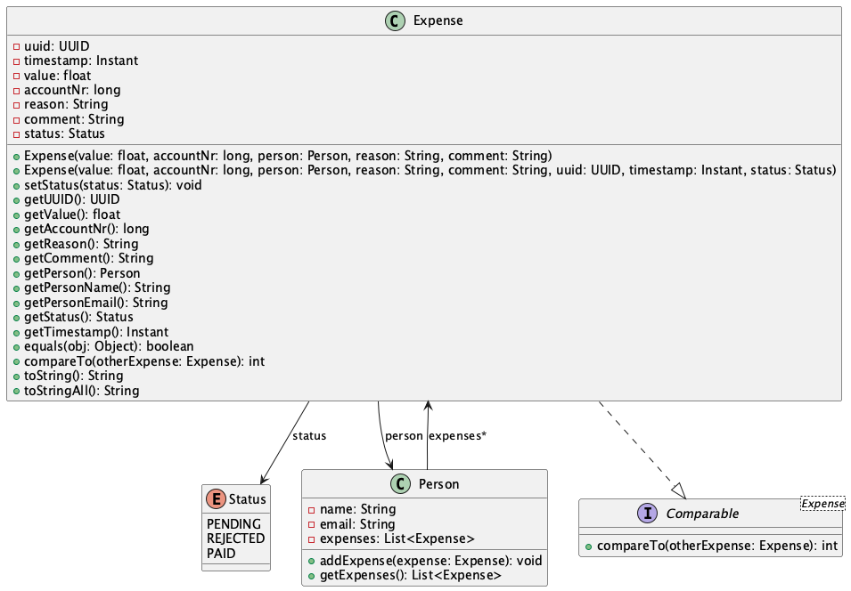

# Expense Form
## Appbeskrivelse
Ideen bak appen er en klone av et verktøy som brukes internt i komiteer linjeforeningen min (Online), et utleggsskjema. Det virker ved at en bruker legger inn utleggene sine for komiteen, med hva de kjøpte, en begrunnelse, verdi og kontonummer slik at de kan få tilbakebetalt utleggene. Programmet holder styr på personene og holder styr på statusen. Slik kan man se om utlegget er tilbakebetalt, avvist eller fortsatt må bli sett på av de(n) som styrer økonomien, og appen har funksjonalitet for å sortere etter person, tid utlegget ble registrert og status. Appen består av to tabs, en for å registrere utlegg, hvor du fyller ut all informasjonen, og en hvor du kan administrere utleggene. På administrasjonssiden vises alle registrerte utlegg, og du kan se tidspunktet utlegget ble registrert og endre på status. Alle utleggene lagres i en csv-fil. Dette ble valgt fordi du kan åpne csv-er i regneark-programmer, noe som hadde vært hjelpsomt for at n eventuell administrator kan få full oversikt.

## Klassediagram

Klassediagrammet viser implementasjonen av Expense-klassen. Dette er kjerneklassen i programmet, og var derfor det mest relevante å ha med. Den viser hvordan den interagerer med den andre klassen i programmet (Person), og hvilke verdier Enum-en Expense.Status har.

## Spørsmål
1. Sp: Hvilke deler av pensum i emnet dekkes i prosjektet, og på hvilken måte? (For eksempel bruk av arv, interface, delegering osv.)

	Sv: I prosjektet dekkes flere sentrale deler av pensum. For det første brukes grensesnitt (interface) gjennom implementering av `Comparable<Person>` i Person-klassen og `Comparable<Expense>` i Expense-klassen, samt `Comparator<Expense>` i komparatorklassene. Dette muliggjør sortering av objekter basert på forskjellige kriterier. Videre demonstrerer prosjektet god bruk av innkapsling ved at alle feltene i modellklassene er private med tilhørende get-metoder. Delegering brukes når ExpenseFileHandler håndterer persistens. Prosjektet viser også bruk av enum (Status i Expense-klassen), samlinger (List<Expense> i Person-klassen), streams for filtrering og aggregering av data, og robust feilhåndtering gjennom validering og unntak (IllegalArgumentException). MVC-arkitektur er implementert med separate modellklasser, controller-klasse og FXML for visningen.

2. Sp: Dersom deler av pensum ikke er dekket i prosjektet deres, hvordan kunne dere brukt disse delene av pensum i appen?

	Sv: Selv om prosjektet dekker mye av pensum, er det noen konsepter som kunne vært ytterligere integrert:
	- Arv: Man kunne implementert en abstrakt baseklasse `User` som `Person` arver fra, med mulighet for forskjellige brukertyper (f.eks. administrator vs. vanlig bruker). Dette kunne f.eks. bli brukt for å gi tilgang til administrasjons-tabben og hvis jeg holder styr på brukeren som har åpnet appen, kunne jeg også ha autofyll på personinformasjonen (navn og epost) når man registrerer utlegg.
	- Observatør-mønsteret: Man kunne implementert et observatør-grensesnitt for å oppdatere UI automatisk når modellen endres, spesielt nyttig for å reflektere endringer i utgiftsstatus.
	- Generics: Man kunne utviklet en mer generisk håndtering av persistens med en generisk klasse som `DataHandler<T>` for å håndtere lagring og lasting av ulike objekttyper.

3. Sp: Hvordan forholder koden deres seg til Model-View-Controller-prinsippet? (Merk: det er ikke nødvendig at koden er helt perfekt i forhold til Model-View-Controller standarder. Det er mulig (og bra) å reflektere rundt svakheter i egen kode)

	Sv: Prosjektet følger MVC-prinsippet gjennom en tydelig separasjon mellom:
	- Model: Representert ved klassene i `model`-pakken (Person, Expense) som håndterer applikasjonens data og forretningslogikk.
	- View: Implementert med FXML-filer som definerer brukergrensesnittet. 
	- Controller: `ExpenseFormController`-klassen fungerer som bindeledd mellom modell og visning.
   
	Selv om denne strukturen er på plass, finnes det forbedringspotensial. Controller-klassen har sannsynligvis for mye ansvar, spesielt med tanke på validering av inndata og sortering av data som kunne vært delegert til egne hjelpeklasser. I en ideell MVC-implementasjon skulle modellen hatt en tydeligere Observable-funksjonalitet for å varsle om endringer, istedenfor at kontrolleren må be om oppdateringer. ExpenseFileHandler-klassen utgjør en god separasjon av persistenslogikk, men kunne vært enda tydeligere integrert i MVC-strukturen gjennom et mer definert grensesnitt mot resten av applikasjonen.

4. Sp: Hvordan har dere gått frem når dere skulle teste appen deres, og hvorfor har dere valgt de testene dere har? Har dere testet alle deler av koden? Hvis ikke, hvordan har dere prioritert hvilke deler som testes og ikke? (Her er tanken at dere skal reflektere rundt egen bruk av tester)

	Sv: I testingen av appen har jeg primært fokusert på enhetstesting av modellklassene (Person og Expense) og deres funksjonalitet, siden disse utgjør kjernelogikken i applikasjonen. jeg har skrevet tester for å validere opprettelse av objekter, at validering av inndata fungerer korrekt, og at beregninger (som total utgiftsverdi) er nøyaktige. 

	Jeg har prioritert å teste forretningslogikken fremfor UI-komponenter, da sistnevnte er vanskeligere å teste automatisk og ofte krever manuelle tester. For persistenslaget (ExpenseFileHandler) har jeg testet både lagring og lasting av data for å sikre at data bevares korrekt mellom programkjøringer.

	Jeg har ikke testet alle edge cases i UI eller alle mulige kombinasjoner av brukerinteraksjoner, men har fokusert på å sikre at kjernelogikken er robust. Dette er en avveining mellom tidsbruk og testdekning, der jeg har prioritert de delene som er mest kritiske for applikasjonens funksjonalitet. I fremtiden kunne jeg utvidet testdekningen med flere integrasjonstester og automatiserte UI-tester for å sikre en enda mer robust applikasjon.
