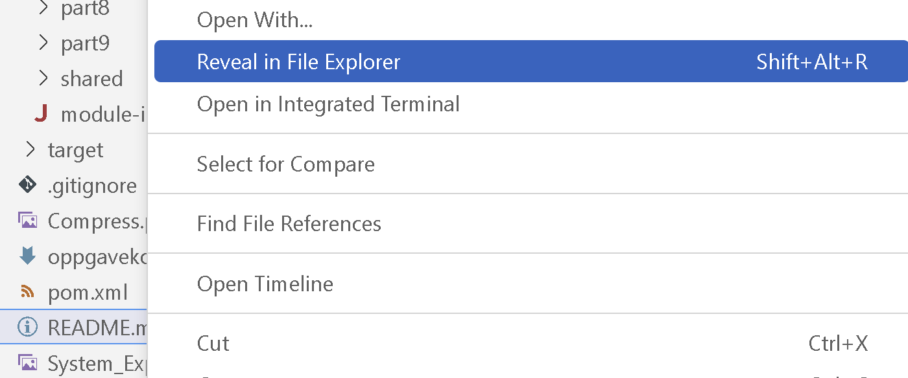
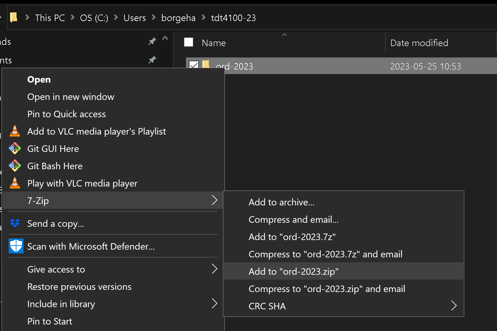

# TDT4100 Javaeksamen vår 2025 - eksamen 1 (0900)

* Les NØYE gjennom dette dokumentet, README for hver oppgave og JavaDoc i den medfølgende koden.

Eksamen består av 6 deler:
* Del 1 består av et sett med flervalgsspørsmål. Dette utgjør 20 % av total poengsum.
* Del 2 består av et sett med kodeoppgaver. Dette utgjør 20 % av total poengsum.
* Del 3-6 har en felles kontektsbeskrivelse der oppgaven din er å bidra til en gitt kodebase. Dette utgjør 60 % av total poengsum.

## DEL 1-2 (40%)

* [Del 1](src/main/java/com/bytebadger/assembly/part1/README.md) (20%)
* [Del 2](src/main/java/com/bytebadger/assembly/part2/README.md) (20%)

## DEL 3-6 (60%)

ByteBadger er et selskap som spesialiserer seg på skreddersydde PC-bygg for privatkunder.

En skreddersydd datamaskin settes sammen av individuelt valgte komponenter i stedet for å kjøpe et ferdigbygd system fra produsenten. Dette gir kundene mulighet til å tilpasse maskinvaren etter sine spesifikke behov. Man kan velge deler basert på ytelse, estetikk, budsjett og mulighet for oppgraderinger.

ByteBadger utvikler ny programvare som brukes i monteringsprosessen for skreddersydde PC-bygg. Programvaren er skrevet i Java. Din oppgave er å bidra til å utvikle deler av koden.

Dine oppgaver er organisert som følger:

* [Del 3](src/main/java/com/bytebadger/assembly/part3/README.md) (15%) - I denne oppgaven skal du implementere klasser basert på grensesnitt.
* [Del 4](src/main/java/com/bytebadger/assembly/part4/README.md) (15%) - I denne oppgaven skal du implementere metoder for å jobbe med en hierarkisk struktur.
* [Del 5](src/main/java/com/bytebadger/assembly/part5/README.md) (15%) - I denne delen skal du implementere metoder for å lese og skrive filer.
* [Del 6](src/main/java/com/bytebadger/assembly/part2/README.md) (15%) - I denne delen skal du implementere metoder for som bruker observatør/observert-mønsteret.

## Viktige merknader

1. Koden for alle delene ligger i [src/main/java/com/bytebadger/assembly](src/main/java/com/bytebadger/assembly/)

2. IKKE MODIFISER KODEN i [src/main/java/no/ntnu/tdt4100/](src/main/java/no/ntnu/tdt4100/).

3. Det er _noen_ tester tilgjengelige. Dersom disse testene er grønne, indikerer det at implementeringen din er korrekt. Testene er tilgjengelig i mappen [test/java/com/bytebadger/assembly](./src/test/java/com/bytebadger/assembly/).

4. Husk at du har tilgang til [Javadokumentasjonen](https://eksamensvedlegg.it.ntnu.no/Felles/jdk-21.0.2_doc-all/api/index.html).

Du kan kjøre testene på følgende måter:

* Du kan åpne en testklasse og kjøre testen med den grønne avspillingsknappen på venstre side av testen. Pilen (eller det røde symbolet for at testen 'feiler') ved linjen for klassedefinisjonen kjører _alle_ testene i klassen. Du kan også kjøre en spesifikk testmetode ved å klikke på denne.

* Du kan også legge til et ‘breakpoint’ i testklassen eller andre klasser som blir brukt, og debugge testen. Dette gjør det mulig å trinnvis gå gjennom koden. Du velger debug ved å høyreklikke på symbolet til venstre for linjen ved metodestart.

* Når du kjører testene _før_ du har implementert noe for en del, vil du oppdage at noen av testene er grønne. Dette er riktig oppførsel. Sørg for at alle testene også er grønne etter at du har implementert kode.

Hver oppgave i eksamen er merket med en // TODO-kommentar. Du kan få en oversikt over alle TODOs i Problems-fanen som ligger i nedre del av redigeringsvinduet i VS Code. Du finner den også i toppmenyen under View -> Problems.

Når JavaDoc eksplisitt spesifiserer et  klasse- eller metodenavn (med JavaDoc her mener vi kommentarene som ligger før en klasse eller metodes definisjon), må du bruke navnet nøyaktig som definert i JavaDoc, dvs. når JavaDoc spesifiserer at klassen skal hete `ComputerPart`, skal den ikke hete `computerPart`, `computerpart` eller `COMPUTERPART`.

I oppgaver hvor unntak skal utløses trenger du ikke bruker tid på spesifisere en melding.

Hvis du ikke skulle klare å implementere en metode i én klasse kan du selvfølgelig bruke denne videre som om den virket. Merk at metoden bør fortsatt kompilere, alle metoder kompilerer ved hjelp av _dummy_ return verdier, som er verdier av riktig type, men ikke korrekte. Metoder med feil vil ikke være synlige som mulige metoder å bruke i VS Code, og dermed gi rød strek.

En metode som ikke kompilerer vil kunne gi null poeng.

Feil i koden din, som NullPointerException er ikke kompileringsproblemer (men vil selvfølgelig ikke gi full poengsum). Dere bør teste deres egen kode slik at dere vet at denne kjører. Vi anbefaler at du bruker testene som er lagt ved. Du kan også kopiere en test over til et nytt testnavn og legge til eventuelle ytterligere metodekall du ønsker å teste.

# Kompilering

**Det skal ikke være noen kompileringsfeil når du sender inn arbeidet ditt. Metoder som ikke kompilerer, vil kunne telle 0 poeng.**

Sørg for at koden kompilerer før du sender den inn. I en terminal, på stien som inneholder `pom.xml`, kan du utføre følgende kommando:

```bash
mvn clean compile
```

## Etter at zipfilen er pakket ut

Etter at du har lastet ned zip-fil, så unzip denne. Dette gir en mappe som heter **ord2025-0900**.

### For Visual Studio Code

Gå så inn i VSCode, og gå til File -> Open Folder. Et filnavigeringsvindu åpnes. Finn frem til mappen du unzippet (**ord2025-0900**), og velg denne. VSCode vil da, pga. POM-filen som ligger i mappen, automatisk finne ut at dette er et Maven Java-prosjekt. (Under forutsetning at Java-utvidelsen er installert i VSCode.)

## Spesialtegn i Windows: tegn som alfakrøll, [], {}, |

I Windows legger en inn disse på en litt annen måte enn i OS X! Alle kan sees på tastaturet, hvis tegnet står nederst til høyre på tasten får en det gjennom å holde inn alt-gr (tasten til høyre for mellomrom) samtidig med tasten med tegnet.

* | er øverst til venstre
* @ er alt-gr og 2
* [,] er alt-gr  og 8,9
* {,} er alt-gr og 7, 0

## Snarveier i VS Code

- Se tastatursnarveier: ctrl-shift-p - skriv inn keyboard  - Open Keybord Shortcuts
* Gå til forrige sted du var i koden: alt-venstrepil - alt-høyrepil for fremover. Som nettleser!
* Klikk på et metodenavn, trykk på F12 og da hopper du inn i koden for denne metoden.

## Levering

**Sørg for å lagre alle filene i VS Code før du zipper folderen.**
Du kan gjøre det via menyvalget option File -> Save All

Når eksamen skal leveres kan du gjøre dette på denne måten:
Kortform: Den samme mappa som du pakket ut, den skal du pakke inn i .zip-format.

* Hvis du ikke har en utforskermeny til venstre: høyreklikk på ikonet for 'Explorer' øverst til venstre (to papirark oppå hverandre)
* Klikk i et tomt område i VSCode sin 'Explorer' (der alle filene til prosjektet ligger) eller høyreklikk på README.md-filen.
* Velg 'Reveal in File Explorer' (Windows)
* Du skal nå få opp et utforskervindu (i Windows) som skal inneholde den folderen du pakket ut. Denne folderen inneholder prosjektfolderen vi skal komprimere.
* Høyreklikk på denne folderen -> 7-zip -> Add to "ord2025.zip"
* Denne zipfilen er filen dere skal laste opp til Inspera til slutt.
* Dere finner et par bilder av prosessen til slutt i denne filen (med feil årstall)

**Visual Studio Code Explorer**



**Compress**

